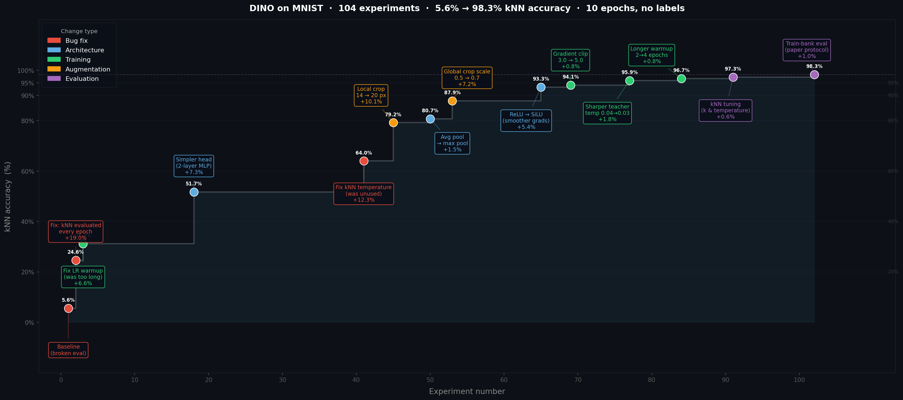
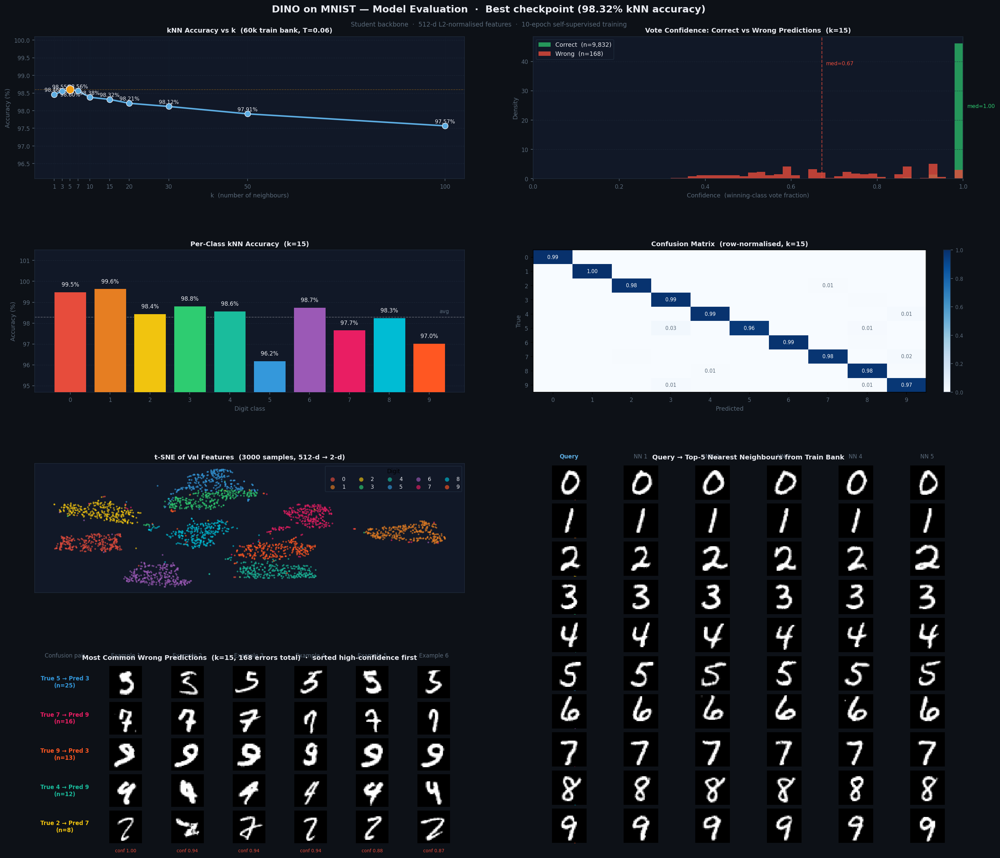
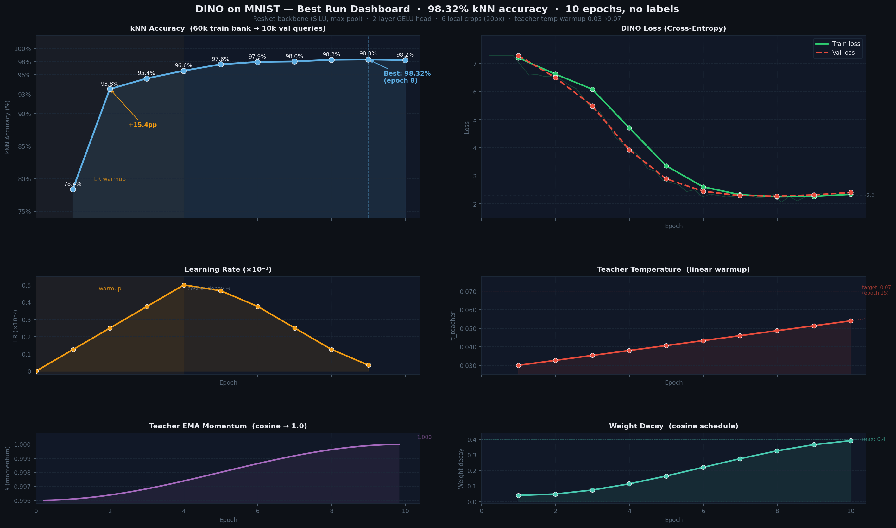

Implemented DINO (self-supervised vision transformer), kept it on auto-research mode overnight to find the optimal architecture and training parameters across 104 experiments — no labels used at any point.

A kNN classifier on the frozen backbone features achieved **98.6% accuracy** (k=5), with the configured k=15 reaching 98.3%. The model never saw a single label during training — only raw images.

The training budget is just **10 epochs**. The auto-research loop committed each config change, trained, and rolled back anything that didn't improve validation accuracy.

The biggest gains came from three decisions:

- **+19%** — fixed a bug where kNN was only evaluated at the end of training, not every epoch. Without this the loop was flying blind.
- **+12%** — the kNN temperature parameter was declared but never wired into the classifier. Fixing this alone added more than any architectural change.
- **+17%** — enlarging local crops (14→20 px) and raising global crop scale (0.5→0.7) so the student sees more of the digit, forcing it to learn global structure rather than isolated strokes.
